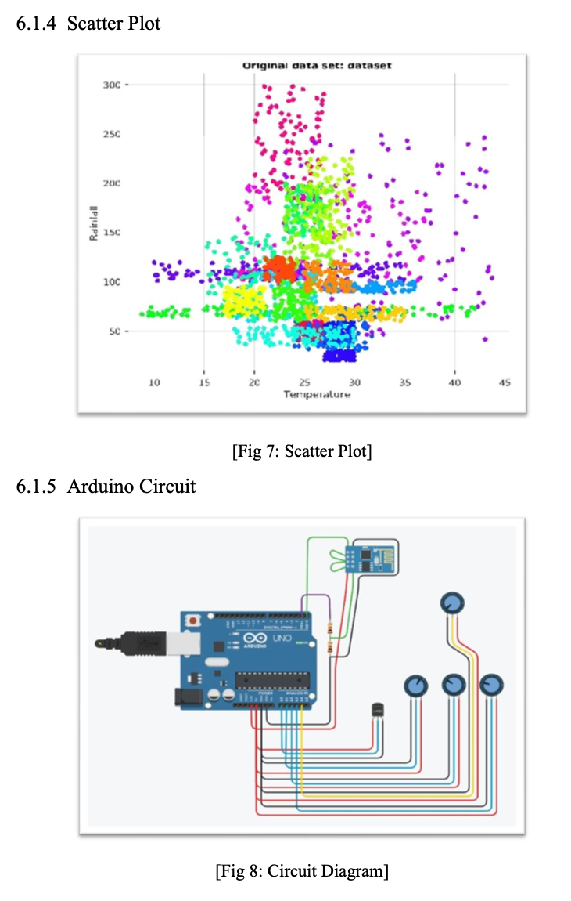
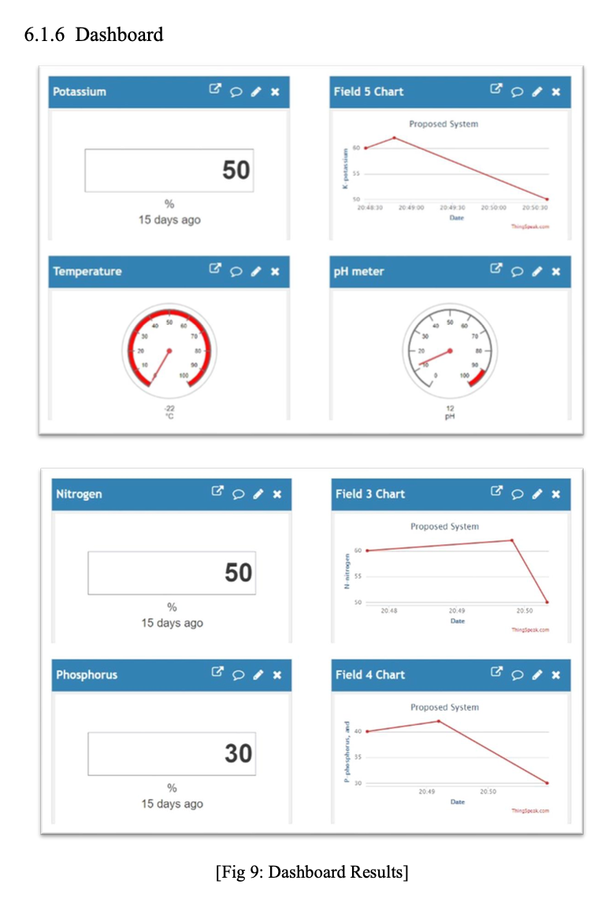

# Crop Prediction System for Smart Agriculture

This project is a culmination of extensive research, aiming to revolutionize the field of smart agriculture. For detailed information, please refer to the [research paper](https://link.springer.com/chapter/10.1007/978-981-19-3575-6_7).

## Project Overview

We have engineered an innovative crop prediction system that significantly enhances reliability and profitability for farmers. Leveraging cutting-edge technologies like Machine Learning and the Internet of Things (IoT), our solution provides accurate predictions for optimal crop selection, thereby maximizing yield. The technology stack comprises Machine Learning, Thingspeak API, Matlab, and Tinkercad.

## Key Features

- Accurate crop predictions for maximum yield
- Integration of IoT for real-time data acquisition
- Utilization of Machine Learning algorithms for precise analysis
- Seamless compatibility with Thingspeak API
- Incorporation of Matlab for data processing
- Prototyping and simulation with Tinkercad

## Benefits

- Empowers farmers with data-driven insights for crop selection
- Enhances overall profitability in agriculture
- Enables real-time monitoring and decision-making
- Reduces resource wastage through targeted cultivation
- Promotes sustainable and efficient farming practices

## Technologies Used

- Internet of Things (IoT)
- Machine Learning
- Artificial Intelligence (AI)
- Matlab

## Architecture

## Project Demonstration

[Watch Demo on YouTube](https://youtu.be/9EWG7ZG6VRA)

